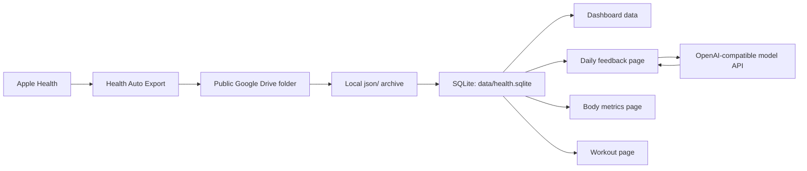

<div align="center">

# Health Dashboard

### A local-first health data pipeline and personal dashboard

**Turn Apple Health JSON exports into SQLite, a static dashboard, a daily feedback page, a body metrics page, and a workout log page.**

[](https://github.com/MingStudentSE/health-dashboard)
[](https://nodejs.org/)
[](https://www.sqlite.org/)
[](#privacy-and-publishing)

[中文 README](./README.md) · [Key Features](#-key-features) · [Quick Start](#-quick-start) · [Usage](#-usage) · [Architecture](#-architecture) · [Changelog](#-changelog)

</div>

---

## Why Health Dashboard?

> Many health data tools either depend too heavily on cloud services or stop at display-only dashboards.
>
> **Health Dashboard** is a fully local health data pipeline. It turns Apple Health exports into a durable SQLite archive, daily notes, workout logs, and a static dashboard, while keeping your personal data on your own machine.

## ✨ Key Features

### 🎯 Local Data Pipeline
- Downloads only new JSON files from a public Google Drive folder
- Keeps raw exports in a local `json/` archive
- Imports only new or changed files into SQLite
- Appends a lightweight sync log for each run

### 📊 Health Dashboard
- Builds a static page from local archived data
- Shows recent health analysis, charts, report calendar, and daily summaries
- Includes body metrics and recent workout summaries
- `web/health-dashboard-standalone.html` can be opened directly in a browser

### 📝 Daily Feedback Page
- Open a day from the calendar and review the full analysis
- Write a journal entry for that day
- Generate feedback from both the data and the journal
- Supports OpenAI-compatible APIs and falls back to a local heuristic generator when no model is configured

### 🧍 Body Metrics Page
- Track weight, body fat, skeletal muscle, chest, waist, hip, body age, score, and notes
- Automatically generate a latest-status summary
- Compare against the previous entry
- Stored in SQLite `body_measurements`

### 🏋️ Workout Page
- Record workout date, exercise name, target area, sets, reps, weight, coach evaluation, and personal feedback
- Summarize per-session body areas, exercise count, total sets, and training volume
- Browse workout history through a heatmap-style calendar, then open a day for details
- Stored in SQLite `workout_sessions`, `workout_exercises`, and `workout_sets`

## 🔁 Data Flow

```text
Apple Health -> Health Auto Export -> Google Drive JSON -> local archive -> SQLite -> dashboard / notes / feedback
```

## 🚀 Quick Start

### Requirements
- Node.js 18+
- Python 3
- `sqlite3`

Check your environment:

```bash
node --version
python3 --version
sqlite3 --version
```

### Install

```bash
git clone <your-repo-url>
cd health
cp health.config.example.json health.config.json
```

### Configure

At minimum, set `driveFolder` to your public Google Drive folder link or folder ID.

If you want model-powered feedback, fill in `openaiCompatible` as well.

```json
{
  "driveFolder": "https://drive.google.com/drive/folders/YOUR_FOLDER_ID",
  "openaiCompatible": {
    "baseUrl": "https://api.siliconflow.cn/v1",
    "apiKey": "YOUR_API_KEY",
    "model": "Pro/deepseek-ai/DeepSeek-V3.2"
  }
}
```

### Run

```bash
npm run sync:drive
```

After syncing, open:

```text
web/health-dashboard-standalone.html
```

If you want the local app and daily pages:

```bash
npm run start
```

If you only want to launch the local app, double-click `run.command` in the repository root.

## 📖 Usage

### Common Commands

Run the full incremental sync:

```bash
npm run sync:drive
```

Alias:

```bash
npm run sync
```

Specify a folder explicitly:

```bash
npm run sync:drive -- --folder "https://drive.google.com/drive/folders/..."
```

Download only the latest JSON file:

```bash
npm run sync:drive -- --latest-only
```

Sync without rebuilding the dashboard:

```bash
npm run sync:drive -- --skip-dashboard
```

Import archived JSON into SQLite only:

```bash
npm run import:sqlite
```

Rebuild static dashboard artifacts only:

```bash
npm run build:standalone
```

Start the local app:

```bash
npm run start
```

Start the local app directly:

```bash
./run.command
```

Sync first, then start:

```bash
./sync-and-run.command
```

### Local Pages
- `/` main health dashboard
- `/body.html` body metrics page
- `/workout.html` workout logging page

### Outputs

After a successful sync, the main outputs are:

- `data/health.sqlite`
- `web/data/health-dashboard.json`
- `web/health-dashboard-standalone.html`
- `data/sync-log.jsonl`
- `data/sync-manifest.json`

When running in local app mode, the project also uses:

- `data/daily-notes/<date>.json`
- `/api/days/:date/note`
- `/api/days/:date/feedback`
- `/api/body-records`
- `/api/workout-records`

The standalone HTML file can be opened directly in a browser without a local server.

## 🏗️ Architecture



### Core Stack

| Module | Technology | Purpose |
|---|---|---|
| Runtime | Node.js | Sync pipeline, page builds, HTTP server |
| Archive reader | Python 3 | Public Google Drive folder reader |
| Storage | SQLite | Local archive and structured queries |
| Frontend | Native HTML/CSS/JS | Static dashboard and local pages |
| Feedback generation | OpenAI-compatible API | Optional model-powered feedback |

## 🧱 Project Structure

```text
health/
├─ json/                         # Archived raw health JSON files
├─ data/                         # Runtime artifacts
├─ scripts/
│  └─ public_drive_json_reader.py
├─ src/
│  ├─ archiveDriveJsonToSqlite.mjs
│  ├─ bodyMetrics.mjs
│  ├─ buildDashboardData.mjs
│  ├─ buildStandaloneDashboard.mjs
│  ├─ importHealthToSqlite.mjs
│  ├─ server.mjs
│  ├─ sqlite.mjs
│  └─ workoutRecords.mjs
├─ web/
│  ├─ app.js
│  ├─ body.html
│  ├─ body.js
│  ├─ daily.html
│  ├─ daily.js
│  ├─ index.html
│  ├─ styles.css
│  ├─ workout.html
│  ├─ workout.js
│  └─ data/health-dashboard.json
├─ health.config.example.json
├─ run.command
├─ sync-and-run.command
└─ package.json
```

## 🔧 Configuration

The default configuration in `health.config.example.json` looks like this:

| Field | Purpose | Required |
|---|---|---|
| `driveFolder` | Public Google Drive folder link or folder ID | Yes |
| `openaiCompatible.baseUrl` | OpenAI-compatible API base URL | No |
| `openaiCompatible.apiKey` | API key | No |
| `openaiCompatible.model` | Model name | No |

If no model config is provided, the project falls back to a local heuristic feedback generator, so it still runs end to end.

## 📚 SQLite Schema

Main tables and views:

- `imported_files`
- `metric_records`
- `daily_metric_totals`
- `daily_sleep_summary`
- `body_measurements`
- `workout_sessions`
- `workout_exercises`
- `workout_sets`

Example queries:

```bash
sqlite3 data/health.sqlite "
SELECT day, total_qty AS steps
FROM daily_metric_totals
WHERE metric_name = 'step_count'
ORDER BY day;
"
```

```bash
sqlite3 data/health.sqlite "
SELECT day, in_bed_hours, asleep_hours, deep_hours, rem_hours, sleep_start, sleep_end
FROM daily_sleep_summary
ORDER BY day;
"
```

## ⚠️ Notes

- This project is intended for personal health workflows, not medical diagnosis
- The dashboard analysis is heuristic and descriptive, not clinical advice
- The bundled Google Drive reader requires the target folder to be publicly readable
- The body metrics and workout pages are manual-entry modules and do not infer circumferences or training details from Apple Health automatically

## Privacy and Publishing

The repository is set up to keep personal runtime files local by default.

- `health.config.json` is ignored
- raw exports inside `json/` are ignored
- SQLite files, sync logs, and daily notes inside `data/` are ignored
- `web/data/health-dashboard.json` and `web/health-dashboard-standalone.html` are ignored
- `data/sync-manifest.json` is ignored
- `data/body-records.json` and `data/workout-records.json`, if present, are legacy migration backups rather than active data sources

## 📝 Changelog

### v0.1.0

**Initial public-facing structured release with:**

- Apple Health JSON incremental archiving
- local SQLite data warehouse
- static health dashboard generation
- daily feedback and journaling
- body metrics and workout logging pages
- OpenAI-compatible feedback support
- local heuristic fallback

---

<div align="center">

**If this project helps you, please give it a ⭐ Star.**

[](https://star-history.com/#MingStudentSE/health-dashboard&Date)

</div>
