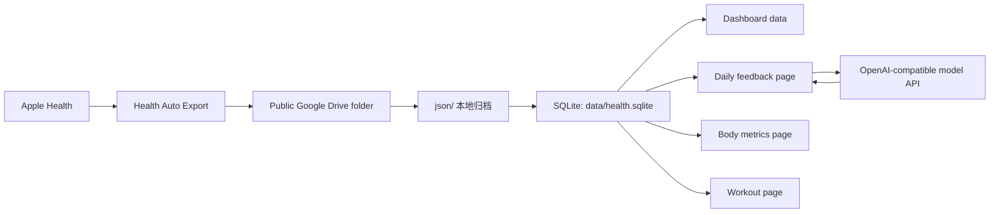

<div align="center">

# Health Dashboard

### 本地优先的健康数据流水线与个人看板

**把 Apple Health 导出的 JSON 自动归档到本地，整理成 SQLite、静态看板、每日反馈页、身体数据页和训练记录页。**

[](https://github.com/MingStudentSE/health-dashboard)
[](https://nodejs.org/)
[](https://www.sqlite.org/)
[](#隐私与发布约定)

[English README](./README.en.md) · [功能特性](#-功能特性) · [快速开始](#-快速开始) · [使用说明](#-使用说明) · [技术架构](#-技术架构) · [更新日志](#-更新日志)

</div>

---

## 为什么选择 Health Dashboard？

> 很多健康数据工具要么过度依赖云端，要么只负责展示，不负责长期积累。
>
> **Health Dashboard** 是一个完全本地化的健康数据流水线。它把 Apple Health 的导出文件变成可长期维护的 SQLite、日报、训练记录和静态看板，并且把个人数据留在你的电脑上。

## ✨ 功能特性

### 🎯 本地数据流水线
- 从公开 Google Drive 文件夹中只下载新增 JSON
- 将原始导出长期保存在本地 `json/`
- 只把新增或变化过的数据导入 SQLite
- 每次同步自动追加一条轻量日志

### 📊 健康看板
- 基于本地归档数据生成静态网页
- 展示最近状态分析、趋势图、报告日历和日常摘要
- 提供身体数据摘要与最近训练摘要
- `web/health-dashboard-standalone.html` 可直接双击打开

### 📝 每日反馈页
- 从日历进入某一天查看完整分析
- 给当天写一段日志
- 基于当天数据和日志生成反馈
- 支持 OpenAI 兼容接口，不配置时自动回退到本地启发式反馈

### 🧍 身体数据页
- 记录体重、体脂、骨骼肌、胸围、腰围、臀围、身体年龄、评分和备注
- 自动生成最新状态摘要
- 自动对比上一条记录的变化
- 统一写入 SQLite 的 `body_measurements` 表

### 🏋️ 健身记录页
- 记录训练日期、动作、动作对应的目标部位、每次训练汇总命中的部位清单、组数、次数、重量、教练评价和个人反馈
- 自动整理每次训练的部位清单、动作数量、总组数和训练量
- 训练历史以日历热力图浏览，点开日期再看具体记录
- 统一写入 SQLite 的 `workout_sessions`、`workout_exercises`、`workout_sets` 表

## 🔁 数据流

```text
Apple Health -> Health Auto Export -> Google Drive JSON -> 本地归档 -> SQLite -> 看板 / 日志 / 反馈
```

## 🚀 快速开始

### 环境要求
- Node.js 18+
- Python 3
- `sqlite3`

先检查本机环境：

```bash
node --version
python3 --version
sqlite3 --version
```

### 安装依赖

```bash
git clone <your-repo-url>
cd health
cp health.config.example.json health.config.json
```

### 配置文件

至少设置 `driveFolder`，它可以是公开 Google Drive 文件夹链接或 folder ID。

如果你要启用每日反馈的大模型能力，再补充 `openaiCompatible`。

```json
{
  "driveFolder": "https://drive.google.com/drive/folders/YOUR_FOLDER_ID",
  "openaiCompatible": {
    "baseUrl": "https://api.siliconflow.cn/v1",
    "apiKey": "YOUR_API_KEY",
    "model": "Pro/deepseek-ai/DeepSeek-V3.2"
  }
}
```

### 运行程序

```bash
npm run sync:drive
```

同步完成后打开：

```text
web/health-dashboard-standalone.html
```

如果要启动本地应用和每日页面：

```bash
npm run start
```

如果只想直接启动本地应用，可以双击仓库根目录下的 `run.command`。

## 📖 使用说明

### 常用命令

完整增量同步：

```bash
npm run sync:drive
```

兼容别名：

```bash
npm run sync
```

显式指定文件夹：

```bash
npm run sync:drive -- --folder "https://drive.google.com/drive/folders/..."
```

只下载最新一个 JSON：

```bash
npm run sync:drive -- --latest-only
```

同步数据但跳过网页重建：

```bash
npm run sync:drive -- --skip-dashboard
```

只执行 SQLite 导入：

```bash
npm run import:sqlite
```

只重建静态网页：

```bash
npm run build:standalone
```

启动本地应用：

```bash
npm run start
```

直接启动本地应用：

```bash
./run.command
```

先同步再启动：

```bash
./sync-and-run.command
```

### 本地页面
- `/` 健康总览首页
- `/body.html` 身体数据记录页
- `/workout.html` 健身记录页

### 输出产物

完成一次同步后，主要产物有：

- `data/health.sqlite`
- `web/data/health-dashboard.json`
- `web/health-dashboard-standalone.html`
- `data/sync-log.jsonl`
- `data/sync-manifest.json`

如果启用了本地应用模式，还会额外使用：

- `data/daily-notes/<date>.json`
- `/api/days/:date/note`
- `/api/days/:date/feedback`
- `/api/body-records`
- `/api/workout-records`

## 🏗️ 技术架构



### 核心技术栈

| 模块 | 技术 | 说明 |
|---|---|---|
| 运行时 | Node.js | 本地同步、页面构建、HTTP 服务 |
| 归档脚本 | Python 3 | 读取公开 Google Drive 文件夹 |
| 数据存储 | SQLite | 本地归档与结构化查询 |
| 前端 | 原生 HTML/CSS/JS | 静态看板与本地页面 |
| 反馈生成 | OpenAI-compatible API | 可选的大模型反馈生成 |

## 🧱 项目结构

```text
health/
├─ json/                         # 原始健康 JSON 归档
├─ data/                         # 运行期产物
├─ scripts/
│  └─ public_drive_json_reader.py
├─ src/
│  ├─ archiveDriveJsonToSqlite.mjs
│  ├─ bodyMetrics.mjs
│  ├─ buildDashboardData.mjs
│  ├─ buildStandaloneDashboard.mjs
│  ├─ importHealthToSqlite.mjs
│  ├─ server.mjs
│  ├─ sqlite.mjs
│  └─ workoutRecords.mjs
├─ web/
│  ├─ app.js
│  ├─ body.html
│  ├─ body.js
│  ├─ daily.html
│  ├─ daily.js
│  ├─ index.html
│  ├─ styles.css
│  ├─ workout.html
│  ├─ workout.js
│  └─ data/health-dashboard.json
├─ health.config.example.json
├─ run.command
├─ sync-and-run.command
└─ package.json
```

## 🔧 配置说明

`health.config.example.json` 中的默认配置如下：

| 字段 | 作用 | 是否必填 |
|---|---|---|
| `driveFolder` | 公开 Google Drive 文件夹链接或 folder ID | 是 |
| `openaiCompatible.baseUrl` | OpenAI 兼容接口地址 | 否 |
| `openaiCompatible.apiKey` | 接口密钥 | 否 |
| `openaiCompatible.model` | 模型名 | 否 |

如果没有配置大模型接口，系统会自动使用本地启发式反馈生成器，项目仍然可以完整运行。

## 📚 SQLite 结构

主要表和视图：

- `imported_files`
- `metric_records`
- `daily_metric_totals`
- `daily_sleep_summary`
- `body_measurements`
- `workout_sessions`
- `workout_exercises`
- `workout_sets`

查询示例：

```bash
sqlite3 data/health.sqlite "
SELECT day, total_qty AS steps
FROM daily_metric_totals
WHERE metric_name = 'step_count'
ORDER BY day;
"
```

```bash
sqlite3 data/health.sqlite "
SELECT day, in_bed_hours, asleep_hours, deep_hours, rem_hours, sleep_start, sleep_end
FROM daily_sleep_summary
ORDER BY day;
"
```

## ⚠️ 注意事项

- 本项目面向个人健康数据归档与回顾，不是医疗诊断工具
- 网页中的分析属于启发式描述，不构成临床建议
- 若要使用内置 Google Drive 读取脚本，目标文件夹必须是公开可读的
- 身体数据页和健身记录页属于手动录入模块，不会自动从 Apple Health 推断三围或力量训练明细

## 隐私与发布约定

仓库默认只提交源码和目录骨架，不提交个人健康数据或本地密钥。

- `health.config.json` 已忽略
- `json/` 中的原始健康导出已忽略
- `data/` 中的 SQLite、同步日志、每日笔记已忽略
- `web/data/health-dashboard.json` 和 `web/health-dashboard-standalone.html` 已忽略
- `data/sync-manifest.json` 已忽略
- `data/body-records.json` 和 `data/workout-records.json` 若存在，仅作为旧版本迁移备份，不再是主数据源

## 📝 更新日志

### v0.1.0

**首个对外整理版本，包含以下能力：**

- Apple Health JSON 增量归档
- SQLite 本地数据仓库
- 静态健康看板生成
- 每日反馈页与日志记录
- 身体数据页与训练记录页
- OpenAI 兼容反馈接口
- 本地启发式回退机制

---

<div align="center">

**如果这个项目对你有帮助，欢迎给一个 ⭐ Star 支持一下！**

[](https://star-history.com/#MingStudentSE/health-dashboard&Date)

</div>
